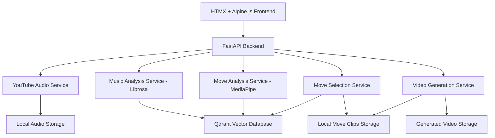

# Design Document

## Overview

The Bachata Choreography Generator is a web-based application that creates personalized dance sequences by intelligently selecting and stitching together video clips from a curated collection of 40 Bachata moves. The system leverages Modal.com for scalable compute, embeddings for musical and movement analysis, and vector similarity search to create authentic choreographies that match the rhythm and style of user-provided YouTube songs.

## Architecture

The system follows a monolithic FastAPI architecture for MVP development with the following key components:



### Core Services

1. **Web Frontend**: HTMX + Alpine.js with server-sent events for real-time progress
2. **YouTube Audio Service**: Downloads and processes audio from YouTube URLs using yt-dlp
3. **Music Analysis Service**: Extracts musical features using Librosa and generates embeddings
4. **Move Analysis Service**: Analyzes move clips using MediaPipe for pose/movement features
5. **Move Selection Service**: Uses Qdrant vector similarity to select optimal move sequences
6. **Video Generation Service**: Stitches selected clips with audio synchronization using FFmpeg

## Components and Interfaces

### 1. Web Frontend Component

**Technology**: HTMX + Alpine.js with Jinja2 templates
**Responsibilities**:
- URL input validation and submission via HTMX
- Real-time progress tracking via Server-Sent Events
- Video playback interface with HTML5 video player
- User preference selection (difficulty, style focus)

**Key Features**:
- HTMX for seamless form submission and content updates
- Alpine.js for reactive progress bar and UI state management
- Server-Sent Events for real-time progress updates
- Responsive design with minimal JavaScript

**Progress Update Structure**:
```python
# FastAPI SSE endpoint
@app.get("/progress/{task_id}")
async def get_progress(task_id: str):
    # Stream progress updates
    yield {
        "stage": "downloading",  # downloading, analyzing, selecting, generating
        "progress": 25,  # 0-100
        "message": "Downloading audio from YouTube..."
    }
```

### 2. YouTube Audio Service

**Technology**: FastAPI endpoint with yt-dlp
**Responsibilities**:
- Validate YouTube URLs
- Extract audio in high quality (MP3, 44.1kHz)
- Handle various YouTube formats and restrictions
- Store audio files locally for processing

**Key Functions**:
```python
class YouTubeService:
    async def download_audio(self, url: str, output_dir: str) -> str:
        # Download and extract audio using yt-dlp
        # Return path to downloaded audio file
        
    def validate_url(self, url: str) -> bool:
        # Validate YouTube URL format
```

### 3. Music Analysis Service

**Technology**: Librosa for audio analysis
**Responsibilities**:
- Extract tempo, beat tracking, and musical structure
- Generate audio embeddings for similarity matching
- Identify musical sections and energy patterns
- Create feature vectors for Qdrant storage

**Key Features Extracted**:
- BPM (beats per minute) using librosa.beat.tempo
- Beat positions and confidence using librosa.beat.beat_track
- Spectral features (MFCC, chroma, spectral centroid, zero crossing rate)
- Musical structure segmentation using librosa.segment
- Energy levels and dynamics using RMS energy
- Harmonic and percussive components separation

**Implementation**:
```python
class MusicAnalyzer:
    def analyze_audio(self, audio_path: str) -> MusicFeatures:
        y, sr = librosa.load(audio_path)
        
        # Extract tempo and beats
        tempo, beats = librosa.beat.beat_track(y=y, sr=sr)
        
        # Extract spectral features
        mfccs = librosa.feature.mfcc(y=y, sr=sr, n_mfcc=13)
        chroma = librosa.feature.chroma(y=y, sr=sr)
        spectral_centroid = librosa.feature.spectral_centroid(y=y, sr=sr)
        
        # Generate embedding vector for Qdrant
        embedding = self.create_embedding(mfccs, chroma, spectral_centroid, tempo)
        
        return MusicFeatures(tempo=tempo, beats=beats, embedding=embedding)
```

### 4. Move Analysis Service

**Technology**: MediaPipe for pose and movement analysis
**Responsibilities**:
- Analyze pose and movement patterns in the 40 move clips
- Extract movement features (speed, direction, complexity)
- Generate movement embeddings for similarity matching
- Classify moves by difficulty and style characteristics

**Key Features Extracted**:
- Pose landmarks and joint angles using MediaPipe Pose
- Movement velocity and acceleration patterns
- Spatial movement patterns (footwork area, upper body movement)
- Rhythm compatibility scores
- Transition points and compatibility

**Implementation**:
```python
class MoveAnalyzer:
    def __init__(self):
        self.pose = mp.solutions.pose.Pose()
    
    def analyze_move_clip(self, video_path: str) -> MoveFeatures:
        # Extract pose landmarks frame by frame
        # Calculate movement patterns and features
        # Generate embedding for Qdrant storage
        
    def extract_pose_features(self, landmarks_sequence):
        # Calculate joint angles, velocities, movement patterns
        # Return feature vector for embedding
```

### 5. Move Selection Service

**Technology**: Qdrant vector database for similarity search
**Responsibilities**:
- Match musical features to move characteristics using vector similarity
- Ensure smooth transitions between selected moves
- Respect difficulty level preferences
- Generate optimal sequence timing based on song structure

**Selection Algorithm**:
1. Query Qdrant with musical embeddings to find compatible moves
2. Filter results by difficulty level and duration constraints
3. Apply transition compatibility scoring using move analysis
4. Optimize sequence for musical structure alignment and flow

### 6. Video Generation Service

**Technology**: FFmpeg with Python subprocess calls
**Responsibilities**:
- Stitch selected move clips in sequence
- Synchronize video timing with audio beats from Librosa analysis
- Apply smooth transitions between clips
- Render final video with original audio track
- Optimize output for web playback

**Implementation**:
```python
class VideoGenerator:
    def create_choreography_video(self, selected_moves: List[SelectedMove], 
                                audio_path: str, output_path: str):
        # Use FFmpeg to concatenate video clips
        # Synchronize with beat positions from music analysis
        # Apply crossfade transitions
        # Overlay original audio track
```

## Data Models

### Move Clip Metadata
```python
@dataclass
class MoveClip:
    id: str
    filename: str
    duration: float  # seconds
    difficulty: str  # beginner, intermediate, advanced
    tempo_range: Tuple[int, int]  # BPM range compatibility
    move_type: str  # basic, turn, footwork, styling
    energy_level: str  # low, medium, high
    pose_embedding: List[float]  # MediaPipe-derived movement features
    music_compatibility: List[float]  # Musical feature compatibility
    transition_compatibility: List[str]  # compatible move IDs
    
    # MediaPipe analysis results
    avg_movement_speed: float
    complexity_score: float
    spatial_area: float  # movement area coverage
```

### Musical Analysis Result
```python
@dataclass
class MusicAnalysis:
    tempo: float
    beat_positions: List[float]
    sections: List[MusicSection]
    audio_embedding: List[float]  # Librosa-derived features
    energy_profile: List[float]
    duration: float
    
    # Librosa-specific features
    mfcc_features: np.ndarray
    chroma_features: np.ndarray
    spectral_centroid: np.ndarray
    zero_crossing_rate: np.ndarray
    harmonic_component: np.ndarray
    percussive_component: np.ndarray

@dataclass
class MusicSection:
    start_time: float
    end_time: float
    section_type: str  # intro, verse, chorus, bridge, outro
    energy_level: float
    recommended_move_types: List[str]
```

### Choreography Sequence
```python
@dataclass
class ChoreographySequence:
    moves: List[SelectedMove]
    total_duration: float
    difficulty_level: str
    
@dataclass
class SelectedMove:
    clip_id: str
    start_time: float  # in final video
    duration: float
    transition_type: str
```

## Error Handling

### YouTube Download Errors
- **Invalid URL**: Return user-friendly error with format examples
- **Restricted Content**: Suggest alternative or provide guidance
- **Network Issues**: Implement retry logic with exponential backoff

### Audio Processing Errors
- **Unsupported Format**: Convert to supported format automatically
- **Too Short/Long**: Set minimum (30s) and maximum (8min) duration limits
- **Poor Quality**: Proceed with warning, suggest higher quality source

### Video Generation Errors
- **Insufficient Moves**: Gracefully handle by repeating compatible moves
- **Rendering Failures**: Provide fallback with simpler transitions
- **Storage Issues**: Implement cleanup and retry mechanisms

## Testing Strategy

### Unit Testing
- **Move Selection Algorithm**: Test with various musical inputs and constraints
- **Video Synchronization**: Verify beat alignment accuracy
- **Embedding Generation**: Validate consistency and similarity metrics

### Integration Testing
- **End-to-End Workflow**: Complete pipeline from URL to video
- **Modal.com Functions**: Test deployment and scaling behavior
- **Vector Database**: Query performance and accuracy testing

### Performance Testing
- **Concurrent Users**: Test system under multiple simultaneous requests
- **Large Files**: Validate handling of longer songs and complex arrangements
- **Resource Usage**: Monitor Modal.com compute and storage costs

### User Acceptance Testing
- **Dance Authenticity**: Validate with Bachata instructors and dancers
- **Musical Alignment**: Test with various Bachata sub-genres and tempos
- **User Experience**: Gather feedback on interface and video quality

## Deployment Architecture

### Local MVP Setup
```python
# FastAPI application structure
app/
├── main.py              # FastAPI app with HTMX endpoints
├── services/
│   ├── youtube_service.py
│   ├── music_analyzer.py
│   ├── move_analyzer.py
│   ├── move_selector.py
│   └── video_generator.py
├── models/
│   ├── music_features.py
│   └── move_features.py
├── static/              # CSS, JS (Alpine.js)
├── templates/           # Jinja2 templates with HTMX
└── data/
    ├── move_clips/      # 40 Bachata move videos
    ├── temp/           # Temporary audio/video files
    └── generated/      # Final choreography videos
```

### Technology Stack
- **Backend**: FastAPI with async support
- **Frontend**: HTMX + Alpine.js + Jinja2 templates
- **Vector Database**: Qdrant (local instance)
- **Audio Analysis**: Librosa
- **Movement Analysis**: MediaPipe
- **Video Processing**: FFmpeg
- **Audio Download**: yt-dlp

### Environment Configuration
- **Development**: Local FastAPI server with file-based storage
- **Future Production**: Modal.com migration for scalability
- **Database**: Local Qdrant instance with persistent storage

### Dependencies
```python
# requirements.txt
fastapi==0.104.1
uvicorn==0.24.0
jinja2==3.1.2
python-multipart==0.0.6
yt-dlp==2023.11.16
librosa==0.10.1
mediapipe==0.10.7
qdrant-client==1.6.9
opencv-python==4.8.1.78
numpy==1.24.3
```

## Security Considerations

### Input Validation
- Strict YouTube URL format validation
- Rate limiting on API endpoints
- Content filtering for inappropriate material

### Data Privacy
- No permanent storage of user-provided content
- Automatic cleanup of temporary files
- GDPR-compliant data handling

### Resource Protection
- Modal.com function timeouts and resource limits
- Cost monitoring and budget alerts
- DDoS protection through rate limiting

## Performance Optimization

### Caching Strategy
- Cache audio analysis results for popular songs
- Pre-computed embeddings for all move clips
- CDN distribution for generated videos

### Parallel Processing
- Concurrent audio download and move clip preparation
- Parallel video rendering for different quality levels
- Asynchronous progress updates

### Resource Management
- Modal.com auto-scaling based on demand
- Efficient memory usage for large audio files
- Optimized vector database queries