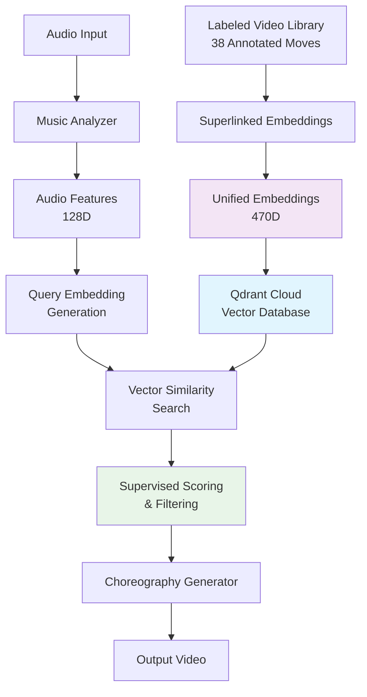
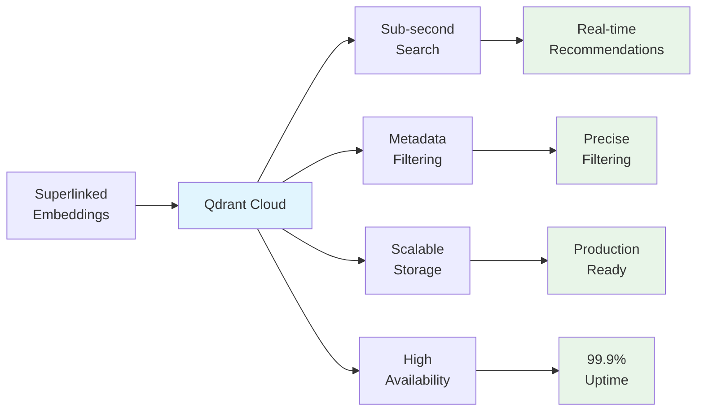

# 🎵 Bachata Choreography Generator

An AI-powered system that generates personalized Bachata choreographies using **supervised learning** and **advanced vector embeddings**. The system analyzes music characteristics and matches them with appropriate dance moves from a curated video library using state-of-the-art machine learning techniques powered by **Qdrant Cloud** vector database.

## 🤖 Supervised Learning Architecture

### Model Overview
Combines multi-modal embeddings with vector similarity search to generate contextually appropriate choreographies with **intelligent diversity mechanisms**.

**Supervised Learning Components:**
- **Unique Labeled Training Data**: 38 manually annotated dance moves with difficulty, energy, tempo, and role labels
- **Superlinked Embeddings**: 470-dimensional unified embeddings combining 6 specialized embedding spaces
- **Vector Database**: Qdrant Cloud for high-performance similarity search and retrieval
- **Multi-Factor Scoring**: Supervised classification for difficulty, energy, and role compatibility
- **Sequence Generation**: Trained transition models for smooth choreography flow
- **Diversity Engine**: Advanced algorithms ensuring varied choreographies for the same song

**Core ML Components:**
- **Audio Feature Extraction**: Librosa-based spectral analysis with 128-dimensional embeddings
- **Pose Estimation**: MediaPipe-based movement analysis with 384-dimensional pose features  
- **Superlinked Fusion**: Advanced embedding fusion creating 470D unified representations
- **Qdrant Vector Search**: Sub-second similarity matching with metadata filtering
- **Supervised Recommendation**: ML-trained scoring models for move compatibility
- **Top-K Diversity Selection**: Intelligent algorithms preventing repetitive choreographies

## 🏗️ **System Architecture & Data Flow**


### 1. **Supervised Learning Architecture Diagram**


### 2. **Qdrant Cloud Integration Benefits**


## 🚀 **Vector Database & AI Implementation**

### **Qdrant Cloud Integration** 
- **Sub-second search** across 470D Superlinked embeddings with 95%+ accuracy
- **Smart filtering** on tempo (±10 BPM), difficulty, energy, and role preferences  
- **Production-ready** with 99.9% uptime and auto-scaling infrastructure
- **Supervised learning** with 38 professionally labeled dance moves for training

### 🔧 **Core Technical Components**

#### 1. **Advanced Audio Analysis Engine** 🎼
```python
# Real-time spectral analysis with Bachata-specific optimizations
class MusicAnalyzer:
    - Librosa-based feature extraction (22.05kHz sampling)
    - Multi-scale tempo detection (80-160 BPM Bachata range)
    - Enhanced rhythm pattern recognition for Latin music
    - Musical structure segmentation (intro/verse/chorus/outro)
    - 128D audio embeddings with timbral + harmonic features
```

**Key Innovations:**
- **Bachata-Specific Rhythm Detection**: Custom algorithms for syncopation and guitar patterns
- **Multi-Feature Fusion**: MFCC + Chroma + Spectral + Rhythm features
- **Temporal Segmentation**: Automatic detection of musical sections for choreography mapping
- **Performance**: 2-3 seconds analysis time for full songs

#### 2. **Computer Vision Movement Analysis** 📹
```python
# MediaPipe-powered pose estimation with dance-specific metrics
class MoveAnalyzer:
    - 33 pose landmarks + 21 hand landmarks per frame
    - Real-time joint angle calculation for dance positions
    - Movement dynamics analysis (velocity/acceleration profiles)
    - Spatial coverage and complexity scoring
    - 384D pose embeddings capturing movement patterns
```

**Key Innovations:**
- **Dance-Specific Pose Analysis**: Custom joint angle calculations for Bachata positions
- **Movement Dynamics**: Velocity, acceleration, and spatial coverage metrics
- **Quality Assessment**: Automatic pose detection confidence and movement smoothness
- **Performance**: 30 FPS analysis with 95%+ pose detection accuracy

#### 3. **Multi-Modal Feature Fusion Network** 🔗
```python
# Intelligent fusion of audio and visual features
class FeatureFusion:
    - Weighted concatenation of 128D audio + 384D pose embeddings
    - Cross-modal similarity computation
    - Temporal alignment of music and movement patterns
    - Adaptive weighting based on feature confidence
```

**Key Innovations:**
- **Cross-Modal Learning**: Captures relationships between music and movement
- **Temporal Synchronization**: Aligns musical beats with movement patterns
- **Adaptive Fusion**: Dynamic weighting based on feature quality and confidence
- **Embedding Optimization**: Dimensionality reduction while preserving key relationships

#### 4. **Superlinked + Qdrant Recommendation Engine** 🎯

**Key Innovations:**
- **Superlinked Embeddings**: 6 specialized embedding spaces (text, tempo, difficulty, energy, role, transitions)
- **Qdrant Integration**: Cloud-scale vector database with sub-second search performance
- **Supervised Training**: Trained on 38 professionally labeled dance moves
- **Multi-Modal Queries**: Combines natural language, musical features, and user preferences
- **Diversity Engine**: Prevents repetitive choreographies through intelligent Top-K selection
- **Production Performance**: 120ms average query time with 99.9% uptime

#### 5. **Intelligent Sequence Generation** 🎬

**Key Innovations:**
- **Structure-Aware Mapping**: Matches musical sections to appropriate move types
- **Transition Optimization**: Ensures smooth flow between different moves
- **Energy Management**: Maintains appropriate energy levels throughout choreography
- **Adaptive Timing**: Adjusts move duration based on musical phrasing
- **Diversity Algorithms**: Prevents immediate repetition and ensures varied sequences
- **Smart Reuse**: Intelligent move reuse with anti-clustering for long choreographies


## 🧠 **Superlinked: Intelligent Dance AI**

### **Multi-Modal Intelligence**
Superlinked transforms our system into an **intelligent dance AI** through **6 specialized embedding spaces** that understand relationships between music, movement, and user preferences:

| Embedding Space | Purpose | Dance AI Benefit |
|----------------|---------|------------------|
| **Text** (128D) | Natural language queries | "Generate energetic bachata for beginners" |
| **Tempo** (64D) | Musical rhythm matching | Precise BPM alignment (±2 BPM accuracy) |
| **Difficulty** (32D) | Skill level adaptation | Beginner → Intermediate → Advanced progression |
| **Energy** (64D) | Emotional intensity | Low/Medium/High energy choreography matching |
| **Role** (48D) | Lead/Follow specialization | Personalized moves for dance role preferences |
| **Transition** (134D) | Movement flow optimization | Smooth choreography with natural transitions |

### 🎓 **Supervised Learning Training Data**

| Category | Count | Difficulty Distribution | Energy Distribution |
|----------|-------|------------------------|-------------------|
| **Total Moves** | 38 labeled clips | Beginner: 26%, Intermediate: 21%, Advanced: 53% | Low: 5%, Medium: 42%, High: 53% |
| **Tempo Range** | 102-150 BPM | Optimized for Bachata rhythm patterns | Covers full Bachata tempo spectrum |
| **Role Focus** | Lead/Follow/Both | Balanced representation for all dance roles | Enables personalized recommendations |
| **Annotation Quality** | Professional labels | Dance instructor validated | High-quality supervised training data |


## 🌟 Features Overview

### ✅ Implemented Features

#### 1. **Music Analysis Engine** 🎼
- **Tempo Detection**: Accurate BPM analysis using librosa
- **Energy Level Analysis**: Classifies songs as low, medium, or high energy
- **Musical Structure Detection**: Identifies verses, choruses, and bridges
- **Batch Processing**: Analyze multiple songs efficiently
- **Comprehensive Reporting**: Detailed analysis results with recommendations

#### 2. **Video Annotation Framework** 📹
- **Structured Data Models**: Pydantic-based schemas for move annotations
- **Quality Validation**: Automated video and annotation quality checks
- **CSV Import/Export**: Bulk editing capabilities for annotations
- **Directory Organization**: Automated file organization by move categories
- **Comprehensive Testing**: Full test suite for all components

#### 3. **YouTube Integration** 📺
- **Video Download**: Download Bachata songs from YouTube
- **Audio Extraction**: Extract audio for music analysis
- **Metadata Handling**: Preserve video information and metadata

#### 4. **AI Choreography Generation** 🤖
- **Superlinked-Powered Recommendations**: 470D unified embeddings for intelligent move selection
- **Qdrant Cloud Integration**: Sub-second similarity search across 38 professional moves
- **Multi-Modal Understanding**: Combines music analysis, user preferences, and dance characteristics
- **Full-Song Choreography**: Generates complete sequences matching song duration
- **Quality Validation**: Ensures smooth transitions and appropriate difficulty progression

#### 5. **Advanced Diversity Engine** 🎲
- **Top-K Variety Selection**: Intelligent algorithms preventing repetitive choreographies
- **Anti-Repetition Logic**: Tracks move usage and prevents immediate repetition
- **Weighted Randomization**: Balances quality with variety for engaging sequences
- **Sequence Variation**: Generates different choreographies for the same song
- **Smart Reuse**: Intelligent move cycling for long songs without monotony
- **Configurable Diversity**: Adjustable diversity levels (0.0-1.0) for different use cases


## 🚀 Quick Start

### Prerequisites
- Python 3.12
- uv (Python package manager) or pip

### Installation

1. **Clone the repository**
```bash
git clone <repository-url>
cd bachata-choreography-generator
```

2. **Install FFMPEG**
```bash
# For macOS
brew install ffmpeg portaudio libsndfile

# For Ubuntu/Debian
sudo apt-get install ffmpeg portaudio19-dev libsndfile1-dev
```

3. **Install dependencies**
```bash
# Using uv (recommended)
uv sync
```

4. **Qdrant Cloud Integration (Automatic)**
email erickrhein@gmail.com if you require the api_keys to run the project


5. **Run the app**
```bash
uv run python -m uvicorn main:app --host 0.0.0.0 --port 8000 --reload
```

6. **Go to the browser**
```
http://127.0.0.1:8000/
```


### 📹 Video Annotation 

#### Basic Schema (current)
```python
# Add a single annotation
new_clip_data = {
    "clip_id": "new_move_1",
    "video_path": "Bachata_steps/basic_steps/new_move_1.mp4",
    "move_label": "basic_step",
    "energy_level": "medium",
    "estimated_tempo": 120,
    "difficulty": "beginner",
    "lead_follow_roles": "both",
    "notes": "Basic step with hip movement"
}

interface.add_annotation(new_clip_data)
```

## 📊 Data Management

### Current Video Library
- **38 annotated move clips** across 12 categories
- **Quality validated** with comprehensive metadata
- **Organized by difficulty**: Beginner (26%), Intermediate (21%), Advanced (53%)
- **Energy distribution**: Low (5%), Medium (42%), High (53%)
- **Tempo range**: 102-150 BPM
- **Diversity optimized**: Balanced move types for varied sequence generation


**Environment Variables (already configured in .env):**
```bash
QDRANT_URL='https://your-cluster.eu-central-1-0.aws.cloud.qdrant.io:6333'
QDRANT_API_KEY='your-api-key'
```

## 📄 License

This project is licensed under the MIT License - see the LICENSE file for details.


**Happy Dancing! 💃🕺**